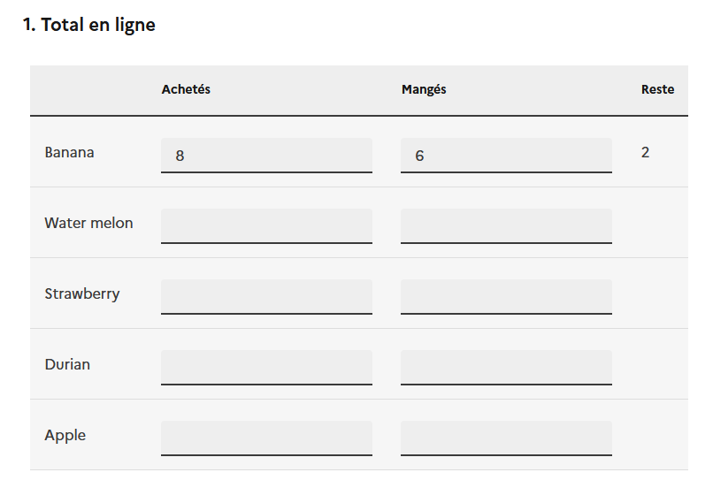
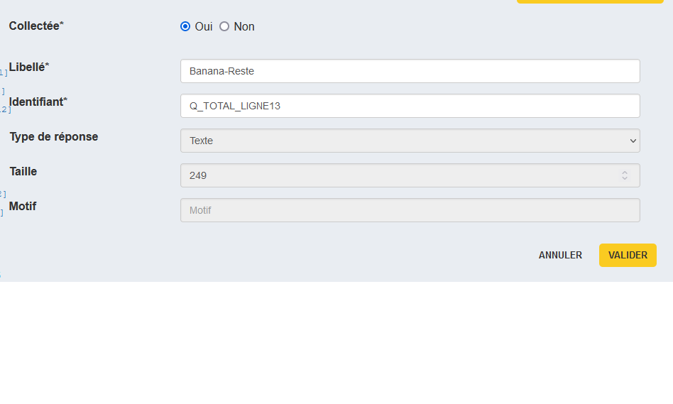
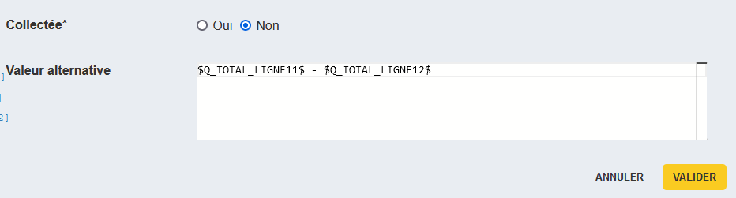

# Les cases non-collectées

:material-test-tube: En cours de développement / recette

## Décrire une case non-collectée

On souhaite parfois qu'une ou plusieurs cases d'un tableau porte une donnée calculée ou externe plutôt qu'une donnée collectée. Par exemple dans le tableau suivant :

les cases de la dernière colonne représentent la différence entre les deux cases précédentes.

Pour spécifier ce type de comportement, Pogues met à disposition le mécanisme de case non-collectée.

Dans le cas d'une tableau fixe par exemple, une case de tableau est une variable standard :

Si on choisit "Non", on peut remplacer la case par une expression VTL, comme ici la différence entre deux variable numériques :

## Total en ligne

...

## Total en colonne

...
