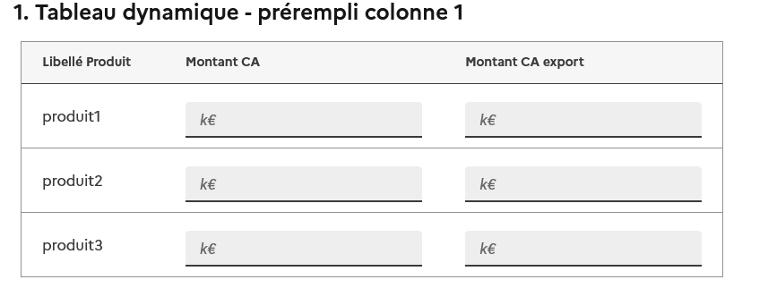
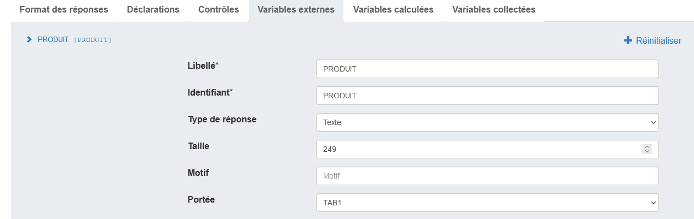
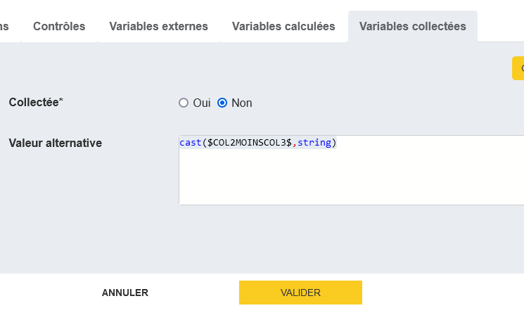

# Les cases non-collectées

:material-test-tube: En cours de développement / recette

## Décrire une case non-collectée

On souhaite parfois qu'une ou plusieurs cases d'un tableau porte une donnée calculée ou externe plutôt qu'une donnée collectée. 

Par exemple dans le tableau de taille fixe suivant où les cases de la dernière colonne représentant la différence entre les deux cases précédentes.:


ou dans le tableau dynamique où la première colonne est une donnée externe - préremplie : 




Pour spécifier ce type de comportement, Pogues met à disposition le mécanisme de __case non-collectée__.

### Dans un tableau fixe

Une case de tableau est par défaut une variable standard collectée. Dans l'onglet "Variables collectées", on note que par défaut la valeur de Collectée est à Oui :


Si on choisit "Non", on peut alors remplacer la case par une expression VTL, comme ici la différence entre deux variable numériques :


### Dans un tableau dynamique

Ici, c'est la __colonne entière__ qui peut ne pas être collectée. Les cas d'usage les plus fréquents seront :

- l'affichage d'une donnée externe (préremplissage par exemple), décrite au préalable :



et utilisée ainsi :


- l'affichage d'une donnée calculée, calculée ainsi :


et utilisée ainsi :




## Total en ligne

### Dans un tableau fixe

C'est très proche de l'exemple juste au-dessus : on donnera comme valeur d'un total en ligne la somme des variables collectées des cases de la ligne.

```
$TABLEAU_FIXE_11$ + $TABLEAU_FIXE_12$ + ... + $TABLEAU_FIXE_1N$
```

où `N` est l'index de la dernière colonne avant la colonne portant le total.

!!! note "Rappel"

    Dans un tableau fixe, les variables générées par Pogues s'écrivent de la forme `<ID_DE_LA_QUESTION><INDICE_DE_LA_LIGNE><INDICE_DE_LA_COLONNE>`.

    Soit, pour la cellule de la ligne 3 et de la colonne 4 du tableau de la question `DEPENSE_QUOTIDIENNE` : `DEPENSE_QUOTIDIENNE34`

!!! tip "Astuce"

    Pour des expressions un peu longue, il est préférable de passer par une [variable calculée](../Variables/variables-calculees.md).

### Dans un tableau dynamique

Le tableau dynamique ne contient pas de variable collectée pour chaque cellule mais il propose une variable vectorielle pour chaque colonne.

Ainsi pour le total en ligne, on écrira simplement comme formule pour la colonne présentant les totaux de ligne :

```
$TABLEAU_DYNAMIQUE_VARIABLE1$ + $TABLEAU_DYNAMIQUE_VARIABLE2$ + ... + $TABLEAU_DYNAMIQUE_VARIABLEN$
```

## Total en colonne

### Dans un tableau fixe

On reprend le principe de la somme en ligne vu plus haut, mais cette fois-ci on somme toutes les variables collectées d'une même colonne pour l'affecter comme valeur de la case représentant le total (a priori la dernière de la colonne).

!!! tip "Astuce"

    Pour avoir un total correct même si toutes les cases ne sont pas remplies, il est nécessaire d'utiliser [la fonction `nvl`](../../Le%20VTL%20dans%20Pogues/vtl.md#gestion-de-la-nullite).

    Par exemple :

    ```
    nvl($TABLEAU_FIXE_11$, 0) + nvl($TABLEAU_FIXE_21$, 0) + ... + nvl($TABLEAU_FIXE_N1$, 0)
    ```

### Dans un tableau dynamique

Comme vu plus haut, chaque colonne correspond à une variable vectorielle (contenant l'ensemble des valeurs). On peut donc écrire tout simplement :

```
sum($TABLEAU_DYNAMIQUE_VARIABLE1$)
```

la fonction `sum` calculant la somme des valeurs contenues dans la colonne.
