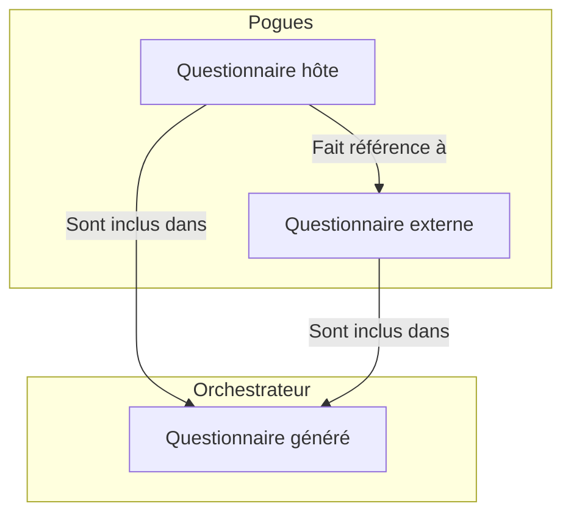
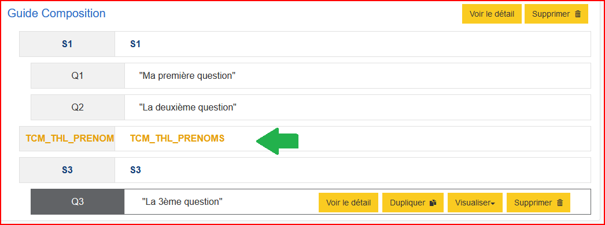
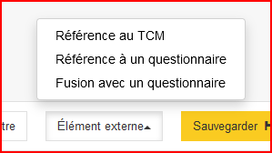
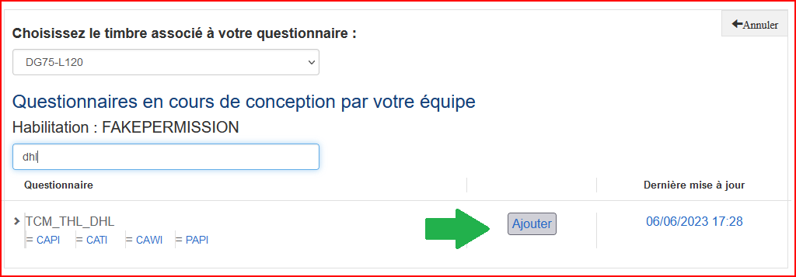
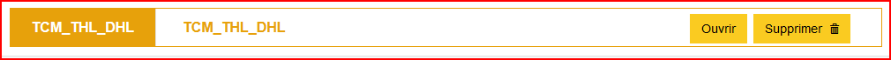
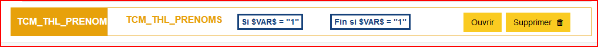

# Composition

!!! tip

    Nouvelle fonctionnalité disponible avec la version __1.1.0__ de Bowie

Pour rendre la conception d'un questionnaire plus flexible, il est possible d'y importer d'autres questionnaires. On _compose_ ainsi un questionnaire à partir de multiples sources.

## Les principes

La fonctionnalité de _composition_ permet d'ajouter des références dynamiques à un ou plusieurs questionnaires externes, références qui sont matérialisées lors de la visualisation du questionnaire hôte.

!!! note

    Référence dynamique signifie ici que tout changement dans le questionnaire cible sera disponible dans le questionnaire qui l'importe, ce qui est différent de la fonctionnalité de Fusion qui copie le questionnaire cible une fois puis ne le met plus à jour.

Le questionnaire Pogues s'enrichit d'un nouvel élément qui marque cette ou ces références à d'autres questionnaires. :point_down:

## Ajouter une référence

Pour ajouter une référence, il faut cliquer sur le bouton "Élément externe" de la barre d'actions, qui va vous proposer :

- _Référence au TCM_ : permet d'ajouter une référence à un module du TCM
- _Référence à un questionnaire_ : permet d'ajouter une référence à tous types de questionnaire
- _Fusion avec un questionnaire_ : permet d'accéder à la fonctionnalité de fusion de questionnaire

Nous nous concentrons ici sur les deux premières options. Le fonctionnement qui suit est le même pour les deux options, la première opère simplement un filtre pour ne proposer que des modules du TCM.

Dans la page qui s'ouvre, il suffit de rechercher le questionnaire que l'on veut référencer dans notre questionnaire puis de cliquer sur _Ajouter_.

La référence est ajoutée dans le questionnaire comme un nouvel élément qui est déplaçable comme une séquence.

On peut également ouvrir le questionnaire référencé ou supprimer la référence.

## Utiliser la référence

Une fois la référence ajoutée, le questionnaire hôte peut mobiliser :

- les __variables__ du questionnaire référencé (les variables collectées, calculées ou externes)
- les __boucles__ du questionnaire référencé (pour la création d'une boucle liée)

Il est également possible de filtrer une référence. :point_down:

