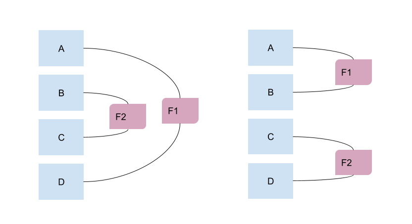
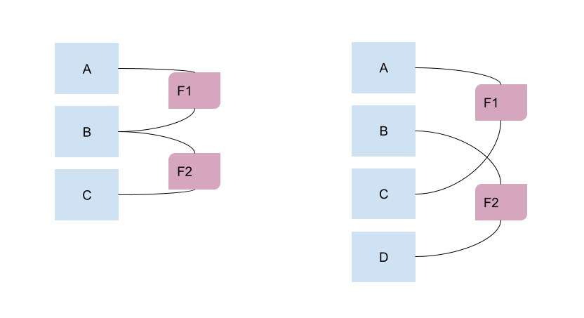

# Les filtres

Un filtre est un élément permettant d'afficher ou masquer une partie du questionnaire en fonction d'une expression VTL.

Pour créer un filtre, il suffit de cliquer sur le bouton "+ Filtre" dans la barre d'action. La fenêtre modale qui s'ouvre affiche les champs :

- _Description_ : un libellé qui sera visible sur le questionnaire papier et remplacera le filtre dynamique des questionnaires web ou enquêteur
- _Condition d'affichage_ : l'expression VTL qui si elle est __vraie__ déclenche l'affichage des éléments filtrés
- _Début_ : détermine où commence la couverture du filtre
- _Fin_ : détermine où termine la couverture du filtre.

## Contraintes d'usage

La première contrainte concerne les éléments de début et de fin du filtre : ceux-ci doivent être de même nature. Par exemple, si un filtre débute sur une séquence, il doit finir sur une séquence (la même ou une séquence se situant plus loin dans le questionnaire).

La seconde contrainte est de ne pas construire des filtres qui se chevauchent - comme illustré plus bas.

!!! note
    Ces erreurs ne sont malheureusement pas captées lors de la conception dans Pogues, mais le seront lors de la génération et la visualisation.

__Filtres corrects__

__Filtres incorrects__

