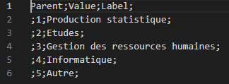

# Liste de code

> WIP

## Chargement à partir d'un fichier CSV

On peut charger une liste de code à partir d'un fichier CSV.

Le fichier lui-même doit avoir les entêtes de colonnes :

- Parent : "1" ou "2" pour préciser le niveau d'arborescence
- Value : le code de l'item de liste
- Label : le libellé de l'item de liste

Par exemple :point_down:

Pour le chargement lui-même, il faut utiliser le bouton "Import d'une liste de codes" au moment de la création de la liste dans Pogues, puis sélectionner le fichier CSV.

