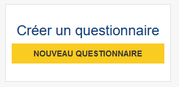

# Création d'un questionnaire

Sur la page d'accueil de Pogues, le bouton suivant est visible :

En cliquant sur le bouton, on ouvre la fenêtre de création du questionnaire. Celle-ci permet de renseigner les informations de classement du questionnaire dans un processus statistique et les paramètres importants au fonctionnement du questionnaire lui-même.

!!! note

    Il est possible qu'à terme les informations relatives au contexte statistique du questionnaire ne soient pas conservées ici mais dans d'autres outils de pilotage du processus d'enquête.

## Information sur le processus

Les champs "Série", "Opération statistique" et "Campagne" sont remplis en fonction de l'enquête correspondante. C'est un processus spécifique au contexte Insee, on ne le détaille pas ici.

!!! tip

    Si vous êtes en train de vous autoformer, vous pouvez choisir n'importe quelle valeur, cela n'a pas d'impact sur le reste du questionnaire

## Identification

Il faut donner un "Titre" et un "Identifiant" au questionnaire. Par défaut, un identifiant sera créé à partir du titre du questionnaire, vous pouvez le modifier.

!!! tip

    Par convention, les identifiants des éléments du questionnaire (séquences, boucles, variables, etc.) seront écrits sous la forme `MON_IDENTIFIANT`

## Modes

Quatre modes de collecte sont disponibles :

- CAPI, pour les enquêtes en face-à-face par l'intermédiaire d'un enquêteur
- CATI, pour les enquêtes par téléphone
- CAWI, pour les enquêtes via Internet
- PAPI, pour les enquêtes au format papier

!!! note

    Actuellement, l'impact sur les questionnaires mêmes est mince : seule les déclarations (aide à la saisie, consigne enquêteur) sont affichées ou non selon leur mode de collecte.

## Dynamisme

!!! warning

    Les options "Redirection" et "XPath" sont en cours d'obsolescence et seront bientôt supprimées.

Les dernières options permettent de définir les aspects dynamiques du parcours du questionnaire :

- la gestion de l'affichage ou non des objets ("Redirection" ou "Filtre")
- le langage utilisé pour les contrôles, filtres, calculs de variables ("XPath" ou "VTL")

Pour ce tutoriel, nous choisissons "Filtre" et "VTL".
