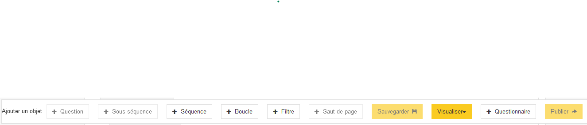

# Création d'une première séquence

Une fois le questionnaire créé, on arrive sur la vue d'ensemble (dite _vue structurelle_) du questionnaire.

Celui-ci est vide, donnons-lui du contenu ! :smile:

!!! tip

    Un questionnaire est composé de séquences, sous-séquences et question. Les possibilités d'articulation sont les suivantes :

    ```
    |-séquence
    |-- question
    |-- sous-séquence
    |--- question
    ```
    
    Un questionnaire contient au moins une séquence, qui contient au moins une question.

    Une séquence contient des questions ou / et des sous-séquences. Une sous-séquence peut contenir des questions.

## Création de la séquence

Pour créer la première séquence, il suffit de cliquer sur le bouton "+ Séquence" de la barre d'actions :


Dans la fenêtre modale qui s'ouvre, on remplit deux champs :

- _Libellé_ avec le titre "Participation au questionnaire"
- _Identifiant_ que l'on modifie pour qu'il soit "MODULE1"

Les modes de collecte restent les mêmes que ceux du questionnaire.

Pour finaliser la création, on appuie sur le bouton "Valider" en bas de la fenêtre :




## Création d'une question

Dans la barre des actions, le bouton "+ Question" permet la création d'une question.

### Identification

Dans la fenêtre modale qui apparaît :

- _Libellé_ "Souhaitez-vous répondre à ce questionnaire ?"
- _Identifiant_ "OKREP"

### Format de réponse

Pogues propose plusieurs formats de réponse qui peuvent être ensuite paramétrés.

Dans l'onglet "Format des réponses", on choisit comme _Type de question_ "Réponse simple" et _Type de réponse_ "Texte", ce qui va permettre de créer un champ de réponse textuel.

On revient dans la section suivante sur le détail des options, mais terminons d'abord la création de cette première question.

Pour cela, il reste une dernière étape, la création de la variable sous-jacente.

### Création de la variable

Pogues distingue la question de la réponse et de la donnée collectée - la variable. Il faut donc explicitement créer cette dernière.

Pour cela, on se dirige vers l'onglet "Variables collectées" puis on clique sur le bouton "Générer variables collectées".

On peut enfin valider la question en cliquant sur le plus gros bouton "Valider" en bas de la fenêtre.

## Sauvegarde du questionnaire

Nous disposons maintenant d'un questionnaire simple, contenant une séquence et une question, il est temps de :material-content-save: __sauvegarder__ ! 

Un simple clic sur le bouton "Sauvegarder" de la barre d'action fait l'affaire.