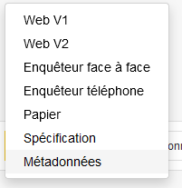

# Visualisation du questionnaire

La promesse de Pogues c'est de permettre la visualisation rapide du questionnaire, dans des modes différents.

Pour cela, en cliquant sur le bouton "Visualiser", on choisit le type de questionnaire que l'on veut générer.

Pour cette première fois, on choisit l'option "Web V2".

!!! note

    Pour des raisons historiques, on a aujourd'hui deux cibles de génération pour un questionnaire web. Cependant, "Web V1" disparaîtra avec la mise en place d'une filière unique de collecte.

Après quelques secondes de création, le questionnaire _web_ est ouvert dans un nouvel onglet du navigateur.

!!! info

    La version du questionnaire ainsi générée est très proche du rendu final mais ne dispose pas de toutes les fonctionnalités d'un questionnaire complètement intégré à la plateforme de collecte.

Vous pouvez vérifier que le questionnaire produit est fidèle à la conception faite dans Pogues.

Nous venons de boucler un premier cycle de conception / visualisation / validation :material-recycle: .