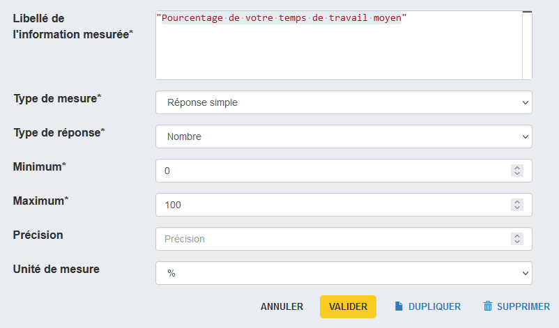

#  Création d'un tableau

La prochaine question se présente sous la forme d'un tableau dans lequel nous allons capter la ventilation des activités de la personne que l'on interroge.

Créons la question avec :

- le libellé "Quel pourcentage de votre temps de travail consacrez-vous en moyenne à ces différentes activités ?",
- et l'identifiant "ACTIVITES".

Nous choisissons ensuite le type de question "Tableau".

## Définition des lignes

Le choix suivant du format de l'axe principal va permettre de déterminer le type de tableau que l'on va construire :

- _Liste_ → pour la création d'un tableau dynamique, c'est à dire d'un tableau dont le nombre de lignes min et max est déterminé par des entiers numériques,
- _Liste de codes_ → pour la création d'un tableau disposant d'entêtes de lignes créés à partir d'une liste de code.

Ici, on choisit le format "Liste de codes".

On [charge la liste de code](../guide/liste-de-code/#chargement-a-partir-dun-fichier-csv) à partir du fichier ["entreprises-activites.csv"](../../data/entreprises-activites.csv).

## Définition des colonnes

Pour créer les colonnes du tableau, rendez-vous un peu plus bas dans la section "Information mesurée". Ici, nous souhaitons créer une colonne pour collecter le pourcentage de temps de travail alloué à chacune des activités de la liste.

On remplit donc le _Libellé de l'information mesurée_ avec "Pourcentage de votre temps de travail moyen" (ce sera le titre de la colonne), puis l'on choisit  :

- _Type de mesure_ "Réponse simple"
- _Type de réponse_ "Nombre" avec un min à 0 et un max à 100
- _Unité de mesure_ "%"

Puis on valide.

Il ne reste qu'à générer les variables puis à valider la question.