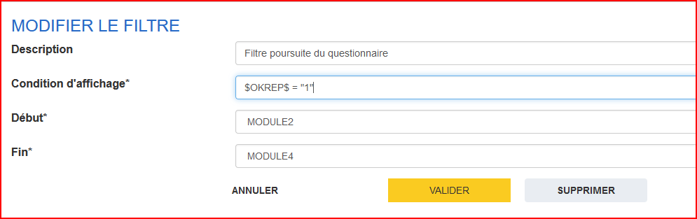
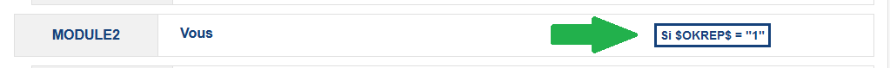

# Mise en place d'un filtre

!!!note

    À partir de cette section, il est utile de s'être familiarisé avec VTL en parcourant [le guide dédié](../guide/vtl.md) et le consultant régulièrement.

L'utilisation de filtres permet de déterminer l'affichage (ou non) d'une ou plusieurs séquences, sous-séquences ou questions.

Pour cela, nous allons nous appuyer sur la fonctionnalité "Filtre" de Pogues mais aussi sur le langage VTL pour l'expression de la condition.

Pour créer un filtre, il suffit de cliquer sur le bouton "+ Filtre" dans la barre d'action. La fenêtre modale qui s'ouvre affiche les champs :

- _Description_ : un libellé qui sera visible sur le questionnaire papier et remplacera le filtre dynamique des questionnaires web ou enquêteur
- _Condition d'affichage_ : l'expression VTL qui si elle est __vraie__ déclenche l'affichage des éléments filtrés
- _Début_ : détermine où commence la couverture du filtre
- _Fin_ : détermine où termine la couverture du filtre.

Le cas d'usage dans le cadre de ce tutoriel est l'affichage des modules (ou séquences) qui suivent la première question (["Souhaitez-vous répondre à ce questionnaire ?"](11-creation-premiere-sequence.md#création-dune-question)). On veut donc s'assurer que la variable associée à cette question (`OKREP`) à la bonne valeur (`"1"` ici qui est le code associé à la modalité "Oui").

Notre condition d'affichage est donc :

```vtl
$OKREP$ = "1"
```

!!!tip

    Bien noter ici :

      - la variable est entourée du caractère `$`
      - le code est bien du texte, il faut l'entourer par le caractère `"`

!!!note

    En toute logique, le filtre que l'on est en train de créer va masquer les éléments choisis dès que la variable `OKREP` aura une valeur différente de "1" :nerd:

Il nous reste à préciser que le filtre à pour champ d'action les modules 2 à 4. Il faut bien noter que les éléments choisis dans _Début_ et _Fin_ sont __inclus__ dans le périmètre du filtre.



Le filtre que l'on vient de créer devient visible dans la vue d'ensemble du questionnaire (sur les éléments choisis dans _Début_ et _Fin_), on peut le modifier en cliquant dessus.


