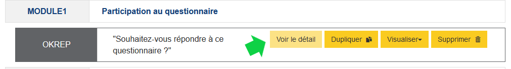
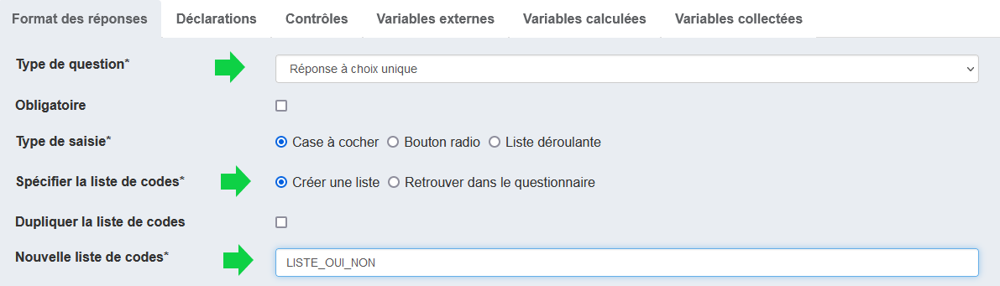
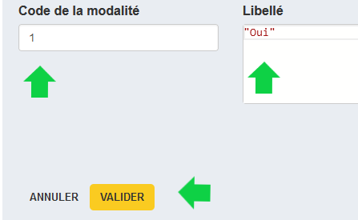

# Création d'une réponse basée sur une liste

Dans notre première version de la question "OKREP", nous avons choisi comme format de réponse un champ textuel. Après coup, il semble préférable de fournir une liste fermée de réponse - "Oui" ou "Non".

Pour modifier la question, il faut sélectionner l'élément qui matérialise cette dernière puis cliquer sur le bouton "Voir le détail" :

## Création d'une liste

Modifions dans l'onglet "Format des réponses" le _Type de question_ pour choisir "Réponse à choix unique".

On garde l'option "Créer une liste", puis on donne un nom à la liste que l'on va créer, par exemple "LISTE_OUI_NON" (champ _Nouvelle liste de code_).

## Ajout de modalités

Sous le champ _Nouvelle liste de code_ on trouve les modalités de la liste. Pour l'instant, cette liste est vide, créons une nouvelle modalité :

- en cliquant sur "+ Ajouter un code"
- dans le champ qui apparaît, en renseignant "1" pour le code de la modalité et "Oui" pour le libellé.
- même chose avec le code "2" et le libellé "Non".

## Finalisation

Nous avons modifié le format de la réponse, il est donc nécessaire [de générer une nouvelle fois la variable sous-jacente](../2-creation-premiere-sequence/#creation-de-la-variable) qui a changé de nature.