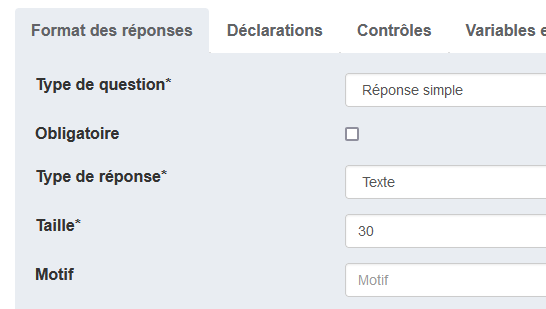

# Élaboration de la structure du questionnaire

Nous poursuivons la construction du questionnaire avec une nouvelle séquence [comme précédemment](../2-creation-premiere-sequence/#creation-de-la-sequence) dont :

- le libellé est "En savoir plus sur vous",
- l'identifiant est "MODULE2".

Nous créons ensuite une première question dans cette séquence :

- avec le libellé "Quel est votre prénom ?"
- et l'identifiant "PRENOM"
- et un type de réponse simple textuelle comme ci-dessous :point_down:.

Pour la question suivante, nous allons créer un tableau.