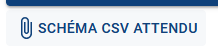
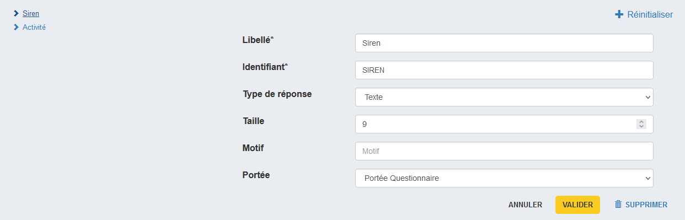
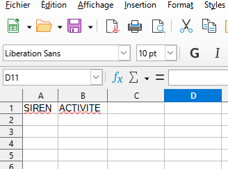
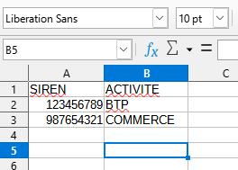

# Création des unités enquêtées

Après l'import du questionnaire Pogues, il faut fournir les unités enquêtées de test afin de créer les questionnaires correspondant dans les différents orchestrateurs.

Pour cela, il faut transmettre un fichier CSV donnant les valeurs associées aux variables externes décrites dans Pogues.

Le bouton "Schéma CSV attendu" permet de télécharger un fichier CSV contenant l'entête des variables, à compléter avec les valeurs associées aux unités enquêtées.

Si mon questionnaire Pogues contient deux variables externes, `SIREN` et `ACTIVITE`, je les retrouve dans le fichier ainsi téléchargé.

Dans Pogues :

Dans le fichier CSV de schéma :

On peut remplir les données à partir de ce fichier schéma :

...

!!!warning

    Un fichier de donnée ne pourra contenir qu'un maximum de 10 unités enquêtées.

Puis charger avec le bouton "Charger les unités enquêtées", puis valider la création avec le bouton "Créer le questionnaire dans les orchestrateurs".

!!!note
    
    Selon la taille du questionnaire cette création peut durer plusieurs minutes.