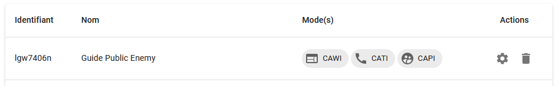

# Visualisation des questionnaires

Une fois l'échantillon chargé, le questionnaire configuré est accessible sur la page d'accueil :

En cliquant sur _CAWI_, on accède à la liste des visualisations enrichies pour ce mode de collecte. Il suffit ensuite de cliquer sur l'icone :material-eye-circle-outline: pour ouvrir le questionnaire.

!!!note

    Dans la version actuelle, seule la visualisation des questionnaires web (_CAWI_) est possible.