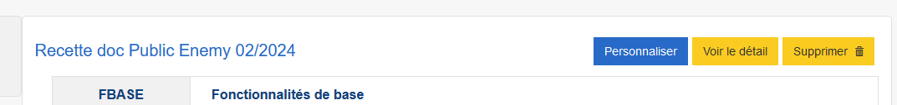

# Premier pas avec Public Enemy

La manière la plus simple de débuter avec Public Enemy est de cliquer sur le bouton __Personnaliser__ depuis votre questionnaire dans Pogues :

Une fois le questionnaire récupéré depuis Pogues, il faut finaliser sa création dans Public Enemy :

- en renseignant le contexte de collecte, "Ménages" ou "Entreprise",
- en ajoutant un fichier de données correspondant aux unités enquêtées pour les tests que l'on souhaite mener - ce que l'on détaille dans la [:octicons-arrow-right-16: section suivante](./1-guide-pe-echantillon.md).

!!! note

    Il est également possible d'ajouter un questionnaire à Public Enemy depuis Public Enemy lui-même, en cliquant depuis la page d'accueil sur le bouton :

    

    Dans la fenêtre qui s'ouvre, il faut donner l'identifiant du questionnaire :

    

    L'identifiant est la dernière section du lien vers un questionnaire. Par exemple, pour :

    `https://conception-questionnaires.insee.fr/questionnaire/abcdef12`

    l'identifiant est `abcdef12`
